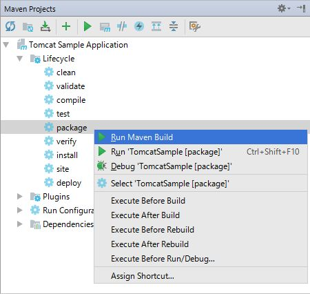
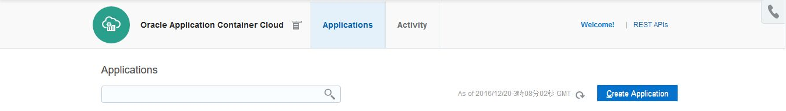
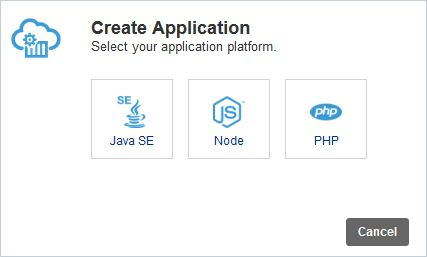
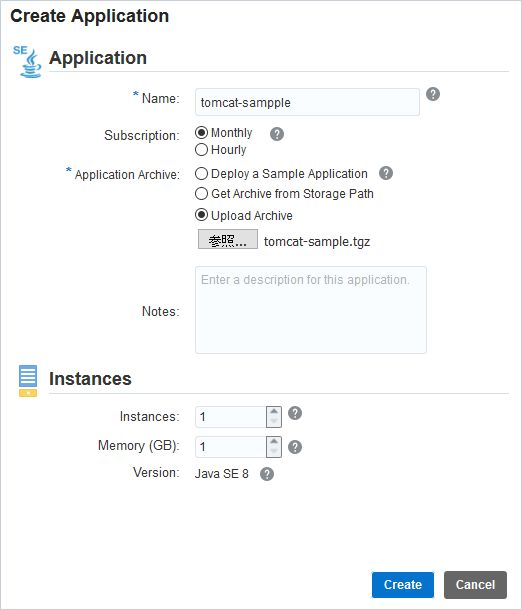
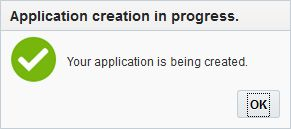
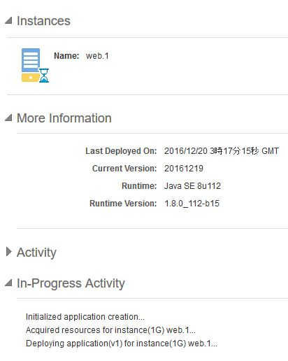
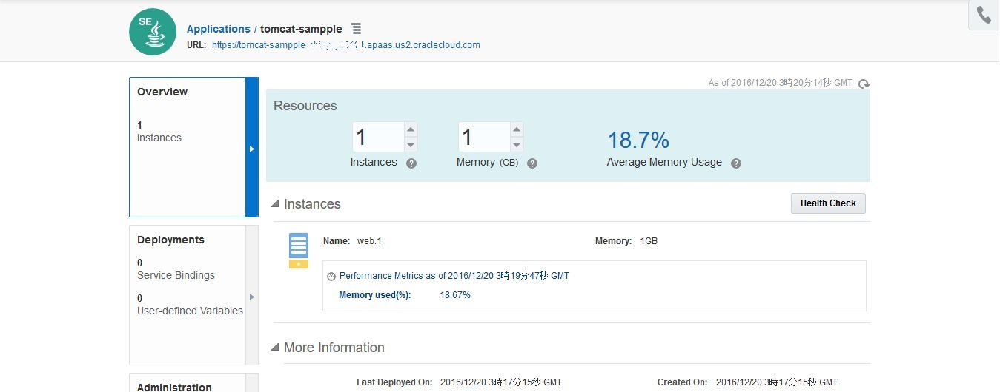
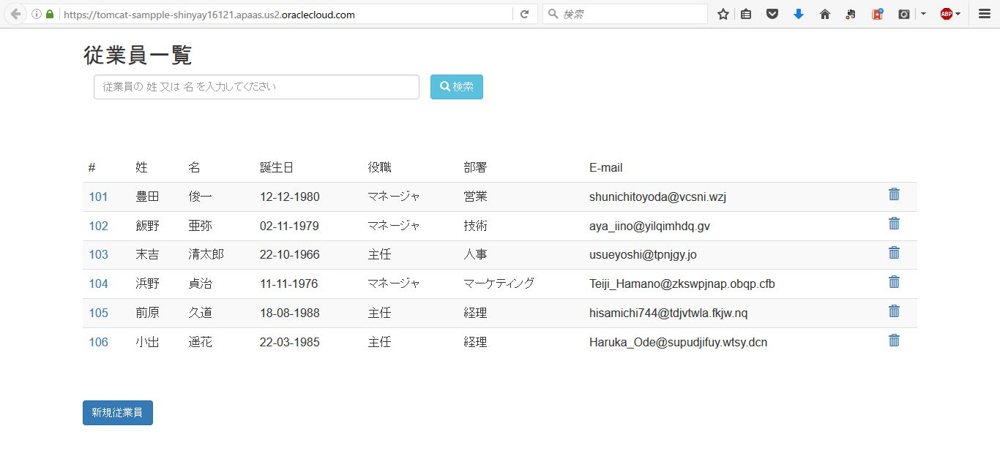

# Application Container Cloud Service へ Tomcat をデプロイ
---
## 説明


**Oracle Application Container Cloud Service** は、基盤を Docker とするアプリケーションの実行環境を提供するクラウド・サービスです。

- [Oracle Application Container Cloud Service を使ってみた](http://qiita.com/shinyay/items/0cef960aa435a72a56f8)
- [Application Container Cloud Service を REST API で操作してみた](http://qiita.com/shinyay/items/8cb3aac11b7f86d6e660)

Docker の基盤レイヤにフォーカスせずに、アプリケーションが稼働するスケーラブルな環境をシンプルかつ素早く提供でしている事が特徴です。そのため ***Dockerfile*** や、***docker-compose.yml*** を記述することもなく、シンプルにデプロイするアプリケーションを用意するだけとなります。

- (参考) Docker 基盤を提供するクラウド・サービス: [Oracle Container Cloud Service](https://cloud.oracle.com/container)
  - [マニュアル](http://docs.oracle.com/cloud/latest/container-cloud/index.html)


この Application Container Cloud Service に、Tomcat で稼働する Web アプリケーションを Tomcat ごとデプロイしてみます。

## 手順

以下の作業の中で作成した Tomcat と Web アプリケーションの環境を Application Container Cloud Service の上へ移行してみます。

- [IntelliJ IDEA を使って Web アプリケーションを Tomcat へデプロイしてみた](http://qiita.com/shinyay/items/a3561bae8f0b1804bbb4)

### WAR ファイルのパッケージ
`maven package` で WAR ファイルのパッケージを行います。



### Tomcat へアプリケーションのデプロイ

**[Tomcatインストールディレクトリ]/webapps/** 配下にアプリケーションを配置します。
ここでは、シンプルな構成をとりたいためコンテキストパスは、**"/"** (ルート・コンテキスト)としておきます。

`webapps` ディレクトリ配下に **ROOT** ディレクトリを作成し、その中に **WARファイル** を展開します。

```bash
$ mkdir [Tomcatインストールディレクトリ]/webapps/ROOT

$ cd [Tomcatインストールディレクトリ]/webapps/ROOT

$ jar xvf [WAR出力ディレクトリ]/tomcat-sample.war
META-INF/が作成されました
META-INF/MANIFEST.MFが展開されました
css/が作成されました
fonts/が作成されました
js/が作成されました
jsp/が作成されました
WEB-INF/が作成されました
WEB-INF/classes/が作成されました
WEB-INF/classes/com/が作成されました
WEB-INF/classes/com/oracle/が作成されました
WEB-INF/classes/com/oracle/jp/が作成されました
WEB-INF/classes/com/oracle/jp/shinyay/が作成されました
WEB-INF/classes/com/oracle/jp/shinyay/employees/が作成されました
WEB-INF/lib/が作成されました
css/bootstrap.min.cssが展開されました
fonts/glyphicons-halflings-regular.eotが展開されました
fonts/glyphicons-halflings-regular.svgが展開されました
fonts/glyphicons-halflings-regular.ttfが展開されました
fonts/glyphicons-halflings-regular.woffが展開されました
fonts/glyphicons-halflings-regular.woff2が展開されました
index.jspが展開されました
js/bootstrap.min.jsが展開されました
jsp/list-employees.jspが展開されました
jsp/new-employee.jspが展開されました
WEB-INF/classes/com/oracle/jp/shinyay/employees/Employee.classが展開されました
WEB-INF/classes/com/oracle/jp/shinyay/employees/EmployeeList.classが展開されました
WEB-INF/classes/com/oracle/jp/shinyay/employees/EmployeeService.classが展開されました
WEB-INF/classes/com/oracle/jp/shinyay/employees/EmployeeServlet.classが展開されました
WEB-INF/lib/jstl-1.2.jarが展開されました
WEB-INF/web.xmlが展開されました
META-INF/maven/が作成されました
META-INF/maven/com.oracle.jp.shinyay.employees/が作成されました
META-INF/maven/com.oracle.jp.shinyay.employees/employees-app/が作成されました
META-INF/maven/com.oracle.jp.shinyay.employees/employees-app/pom.xmlが展開されました
META-INF/maven/com.oracle.jp.shinyay.employees/employees-app/pom.propertiesが展開されました

$ ls
css  fonts  index.jsp  js  jsp  META-INF  WEB-INF
```

### manifest.json の作成

Application Container Cloud Service は、前述のように **Docker** 上にアプリケーション実行環境を用意するクラウド・サービスですが、***Dockerfile*** は作成しません。
代わりに、**ENTRYPOINT** を指し示すために **manifest.json** を作成します。

以下のように作成します:

```json
$ cat manifest.json
{
    "runtime":{
        "majorVersion": "8"
    },
    "command": "sh bin/catalina.sh run",
    "release": {
        "build": "1.0-SNAPSHOT",
        "commit": "On-P to ACCS",
        "version": "20161219"
    },
    "notes": "Stand-alone Tomcat Test"
}
```

ランタイム環境の JDK を **8**
起動コマンドで、**catalina.sh run** を設定して Tomcat の起動を行っています。

#### manifest.json シンタックス

**manifest.json** では、以下の内容を記述することができます。

|大項目|小項目|説明|必須項目|
|---|:---:|:---|:---:|
|runtime||||
||majorVersion|ランタイム環境のバージョン<br>Javaの場合: 7 / 8<br>Nodeの場合: 0.10 / 0.12 / 4.4 / 6.3<br>PHPの場合: 5.6 / 7.0|○|
|command||アプリケーションの実行コマンド|○|
|startupTime||アプリケーションの開始までの待機時間(秒)<br>デフォルト: 30秒<br>10 - 120 の間で設定|-|
|release||||
||build|ビルドを表す値|-|
||commit|コミットを表す値|-|
||version|バージョンを表す値|-|
|notes||任意のコメント|-|
|mode||アプリケーション再デプロイメント時の再起動の仕方<br>デフォルト: 同時<br>**rolling**: オプション指定時にローリング再起動|-|
|isClustered||**true** 設定時にクラスタとして動作<br>**フェイルオーバー**を行う|-|

### manifest.json の配置

作成した **manifest.json** を、Tomcat インストールディレクトリに配置します。

```bash
$ cp manifest.json [Tomcatインストールディレクトリ]
$ ls [Tomcatインストールディレクトリ]
bin  conf  lib  LICENSE  logs  manifest.json  NOTICE  RELEASE-NOTES  RUNNING.txt  temp  webapps  work
```

### Application Container Cloud Service 用アーカイブファイル作成

Application Container Cloud Service 用のアーカイブファイルを作成します。アーカイブファイルの中には、先に作成した **manifest.json** と、**Tomcat** を含めます。

アーカイブファイル内のディレクトリ構成は、manifest.json がルートディレクトリに配置されているようにします。

したがって、先に manifest.json を配置した、Tomcat インストールディレクトリの配下でアーカイブします。

対象のフォーマットは、**.zip** / **.tar** / **.tgz** です。

```bash
$ cd [Tomcatインストールディレクトリ]

$ tar zcvf ../tomcat-sample.tgz *
bin/
bin/bootstrap.jar
bin/catalina-tasks.xml
bin/catalina.bat
bin/catalina.sh
bin/commons-daemon-native.tar.gz
...
...
...
work/Catalina/localhost/_/org/apache/jsp/jsp/
work/Catalina/localhost/_/org/apache/jsp/jsp/list_002demployees_jsp.class
work/Catalina/localhost/_/org/apache/jsp/jsp/list_002demployees_jsp.java
work/Catalina/localhost/_/SESSIONS.ser

$ cd ..

$ ls
apache-tomcat-7.0.73  bin  images  manifest.json  maven  README.md  tomcat-sample.tgz
```

Application Container Cloud にデプロイする アーカイブファイル `tomcat-sample.tgz` が生成されました。


### Application Container Cloud Service へのデプロイ

Application Container Cloud Service のサービス・コンソールを開き、**Create Application** をクリックします。




**Java SE** を選択します。




適当な名前をつけ、**Upload Archive** を選択し、**参照...** をクリックして`tomcat-sample.tgz` を選択します。
最後に **Create** をクリックします。




以下のダイアログが表示されたら、**OK** をクリックします。




インスタンスの作成が始まります。




暫くすると、インスタンスが作成され、画面左上部にアクセス URL が表示されます。これをクリックします。




オンプレミス環境で稼働させていた Tomcat 環境を Application Container Cloud 上に移行する事ができました。




## まとめ

manifest.json のシンタックスで記載しましたが、Application Container Cloud Service で使用できる Java のバージョンは **Java SE 7** と **Java SE 8** です。
この Java のバージョンでの動作が可能な Tomcat 環境は、**manifest.json** だけ作れば、Application Container Cloud Service にそのまま持っていく事もできそうです。
